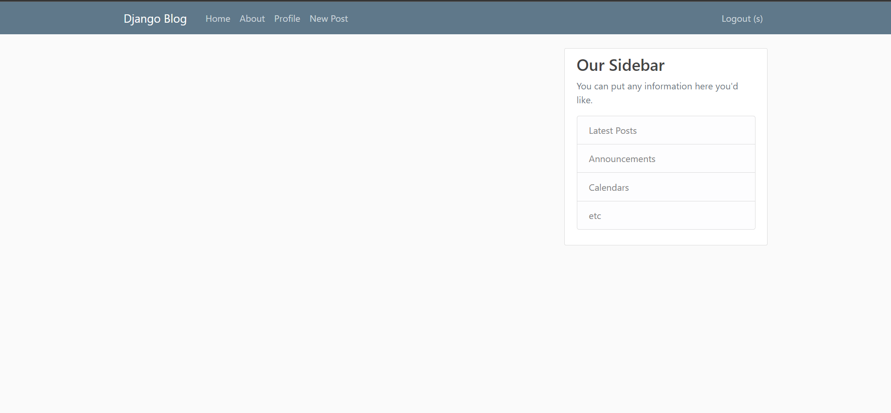

# Django Blog

Django blog is a website that helps users to write, update, delete and view other's blog posts.

# How to run the project?

1. Install django
   `pip install django`

2. Run the django server
   `python manage.py runserver`

After running the server, you will get the output screen as:

# What can you do with the website?

1. You can register yourself to use the blog by going to the 'New Post' link.
2. You can login after registering to the blog website.
3. Now you can start to post the blog.
4. Also, you can delete, update and view other people's blog.

**NOTE: You can visit /admin to get the admin access**
**Admin Username: s**
**Admin Password: s**
